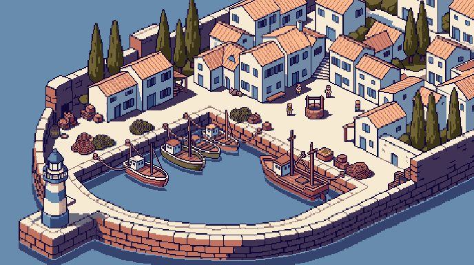
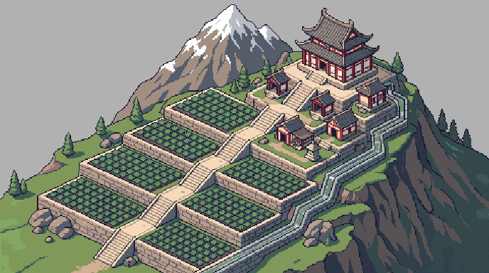
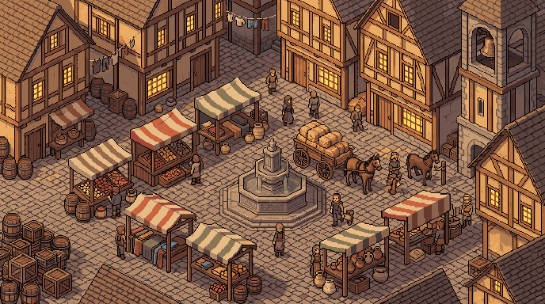

# MAPVIS

**Paint a picture. Walk around inside it.**

### [mapvis-atc.vercel.app](https://mapvis-atc.vercel.app)

MAPVIS turns a flat image into a map a character can actually move through. You bring one picture.
It leaves as a map with ground, walls, height and things that move.

  

## How it works

**One picture, start to finish.** Nothing is built out of tiles and nothing snaps to a grid, so a map
looks like exactly what it was painted as. A harbour looks like a harbour, not like a harbour
assembled from forty reusable harbour pieces.

**You paint the rules onto it.** The quay above is ground. The water is not. The sea wall is
something you pass behind rather than walk through. You draw each of those onto the picture itself,
at full resolution, one pixel at a time if that is what it takes.

  

**Height is a value under every pixel.** The stairs here climb four levels and the retaining walls
beside them do not, because each pixel carries its own elevation rather than belonging to a layer.
Walk up the steps and you rise. Walk into the wall and you stop.

  

**Anything that should move comes off the painting.** A trader, a cart, a gull, a lantern flickering
over a door. Each one is given a behaviour rather than an animation, so it wanders or drifts or paces
on its own and never loops back to the same frame at the same moment.

**Then you walk it yourself.** Before a map goes anywhere, you put a character on it and try the
route. If a doorway is a pixel too narrow, you find out here.

## One hand, many maps

Before you describe a map, you choose whose hand draws it. A **style card** carries the craft and
nothing else: the projection, how chunky the pixels are, how edges are outlined, where the light
falls, how saturated it all is. It never carries a subject.

Typing a kind fills in what the engine needs of that class and nothing about the place. An island
gets a transparent coast, because the engine draws its own moving ocean underneath it. A room gets
character scale and no sky. Two people both typing "island" get two different islands drawn by the
same hand, which is the whole point: a kind is a scaffold, never a copy.

The hand then stays on the map. Every prop generated for it afterwards is drawn the same way, so a
bookshelf made for a room belongs to that room. Published maps carry the card's name, so anything
reading a bundle can say which hand drew it.

Choosing **Other** sends your words as you typed them, with no card at all.

## What comes out

A finished map is a bundle: the picture, the ground and height data, everything placed on it, and the
names you gave the places that matter. Games read it over a plain HTTP API, and every version is kept
forever, so a game can point at the exact map it was built against and never have that map change
underneath it.

Naming is the part worth caring about. A door you called `harbour_gate` is `harbour_gate` to whatever
reads the map, and renaming it later moves every reference with it.

---

Source is visible under [PolyForm Noncommercial 1.0.0](LICENSE). The artwork is pixel art made
with [PixelLab](https://pixellab.ai) and is subject to PixelLab's terms, not to that licence. Maps
made in MAPVIS belong to whoever drew them.
